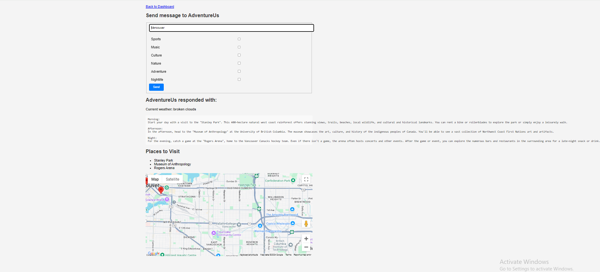

# Adventure US
https://cmpt276-project-1.onrender.com/login
Welcome to AdventureUS, a travel planning app designed to help international students at Simon Fraser University (SFU) explore Burnaby and Vancouver with ease. Whether you're new to the area or just want to discover new places, AdventureUS creates personalized itineraries to match your preferences.
The current methods of travel planning often involve a combination of manual research and reliance on existing travel advisories and platforms such as TripAdvisor. While these resources offer valuable insights into popular attractions and dining options, they may not sufficiently cater to the specific needs and preferences of individual travelers, especially those who are new to the area. International students, in particular, face the challenge of navigating a new city without the benefit of local knowledge or established networks.
Recognizing the existing methods of travel planning as time-consuming and often lacking personalization, requiring users to sift through a plethora of options to create a cohesive plan for their day. The proposed web application seeks to streamline the process of itinerary planning by providing tailored suggestions for activities, dining options, and sightseeing destinations throughout the day. By automating this process, users, particularly international students, will benefit from a curated guide that maximizes their exploration of the Greater Vancouver area. 

# Why We Built AdventureUS
As international students, we understand the challenge of navigating a new city without much local knowledge. While tools like TripAdvisor exist, they don't always provide personalized recommendations for new arrivals. We wanted to solve this by creating a simple, intuitive platform that gives international students tailored suggestions for activities, dining, and sightseeing — all in one place.

# Key Features

Personalized Itineraries: Get curated day plans based on your interests, the time of day, and the weather.Personalized Itineraries: Get curated day plans based on your interests, the time of day, and the weather.

Past Trip History: Save and revisit past itineraries for future trips.

Weather Considerations: The app suggests activities based on the current weather conditions.

# How it Works

AdventureUS makes use of several powerful tools to offer a smooth travel planning experience:

Google Maps API: Helps you find nearby restaurants, cafes, and attractions, complete with ratings and reviews.
Weather API: Provides real-time weather data to suggest the best activities for any day — rain or shine.
Gemini AI: Assists in building custom itineraries based on your location, weather, and preferences.

# Imagine This

Farquad is an international student at SFU and wants to explore Vancouver with his friends for the weekend. Using AdventureUS, he creates a day-long itinerary with personalized suggestions for sightseeing, dining, and activities. Not only does he discover exciting new places, but he also shares his itinerary with his friends, ensuring they all have a great time together!

# What's Next?

We’re always looking for ways to make AdventureUS even better. In the future, we plan to add:

Budgeting tools to help you stay on track with expenses.
Custom filters so you can fine-tune your itinerary based on specific preferences.
Partnerships with student organizations to expand the reach of AdventureUS.

#Our Team
Our group brings together a mix of back-end and front-end skills to build this app. While Nicholas, Arav, and Kenneth handle the back-end coding and APIs, Steven and Tony focus on designing an intuitive user experience. Together, we’ve created AdventureUS to be simple, functional, and fun!

